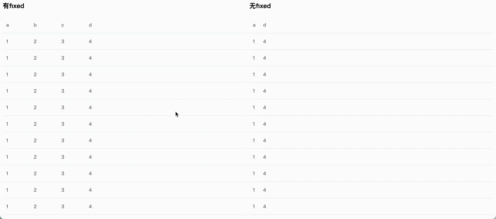

# el-table-horizontal-scroll

> let el-table show horizontal scroll-bar at bottom

[中文文档]('./README_CN.md')

## How to use



### install

```
npm install el-table-horizontal-scroll
```

### register directive

```
import horizontalScroll from 'el-table-horizontal-scroll'
Vue.use(horizontalScroll)
```

or

```
import horizontalScroll from 'el-table-horizontal-scroll'

export default {
    directives: {
        horizontalScroll
    }
}
```

### use

```
<el-table
  :data="data"
  v-horizontal-scroll
>
  <el-table-column
    fixed="left"
    label="a"
    prop="a"
  ></el-table-column>
  <el-table-column
    label="b"
    prop="b"
  ></el-table-column>
  <el-table-column
    label="c"
    prop="c"
  ></el-table-column>
  <el-table-column
    label="d"
    prop="d"
    width="1600"
  ></el-table-column>
</el-table>
```

## props

you can use `always` or `hover`

default is `hover`, the bar will show when your mouse over the table

or you can change it to always, and make the bar always show

example

```
<el-table
  :data="data"
  v-horizontal-scroll="'always'"
>
  <el-table-column
    fixed="left"
    label="a"
    prop="a"
  ></el-table-column>
  <el-table-column
    label="b"
    prop="b"
  ></el-table-column>
  <el-table-column
    label="c"
    prop="c"
  ></el-table-column>
  <el-table-column
    label="d"
    prop="d"
    width="1600"
  ></el-table-column>
</el-table>
```
